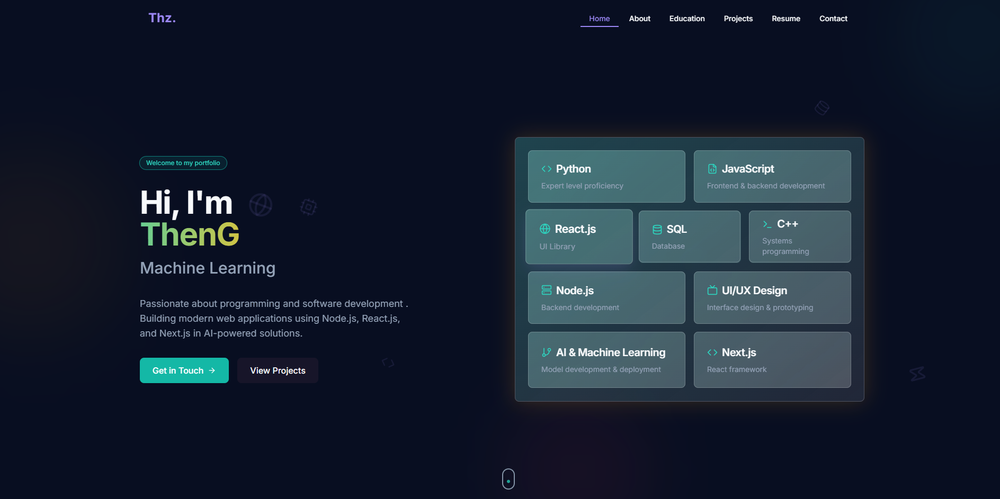

# 🚀 My Portfolio Website (React + TypeScript)

## 📝 Overview
A modern, responsive personal portfolio website designed to showcase my professional skills, projects, and experience. Built with **React** and **TypeScript** to provide a seamless, interactive user experience.

🌐 **Live Demo**
[](https://www.theng.studio/)


## 🛠 Technologies Stack
- **Frontend Framework**: React 18
- **Language**: TypeScript
- **Build Tool**: Vite
- **Styling**: CSS (not Tailwind)
- **Background Effect**: react-tsparticles
- **Routing**: React Router

## 🌐 Project Structure

## 🚀 Getting Started

### Prerequisites
- Node.js (v16.0.0+)
- npm (v8.0.0+)

### Installation
1. Clone the repository
```bash
git clone https://github.com/yourusername/your-portfolio.git
cd your-portfolio
```

2. Install dependencies
```bash
npm install
```

3. Start development server
```bash
npm run dev
```
4. Production Build (Optional)
```bash
# Build for production
npm run build

# Preview production build
npm run preview
```
## ✨ Key Features
- Interactive Particle.js Background (react-tsparticles)
- Minimal & Clean UI
- Fully Responsive Design
- Projects Showcase
- Academics Page 

## 📦 Deployment
- Easily deployable on:
- Vercel(I've used vercel, but you are free to any of the below)
- Netlify
- GitHub Pages

Example Vercel Deployment
```bash
# Install Vercel CLI
npm install -g vercel

# Deploy
vercel --prod
```
## 🤝 Contributing
1. Fork the repository
2. Create your feature branch (`git checkout -b feature/AmazingFeature`)
3. Commit your changes (`git commit -m 'Add some AmazingFeature'`)
4. Push to the branch (`git push origin feature/AmazingFeature`)
5. Open a Pull Request

## 📜 License
Distributed under the MIT License. See `LICENSE` for more information.

## 🙏 Acknowledgments
- React Community
- Vite.js Team
- Tailwind CSS
- Framer Motion
- TypeScript Team

---

**Created with by Uday**

**📌 Note**: This portfolio template is open-source. While free to use, attribution is appreciated..


